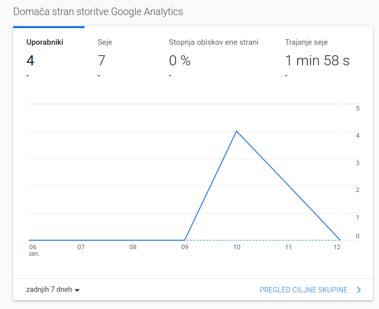
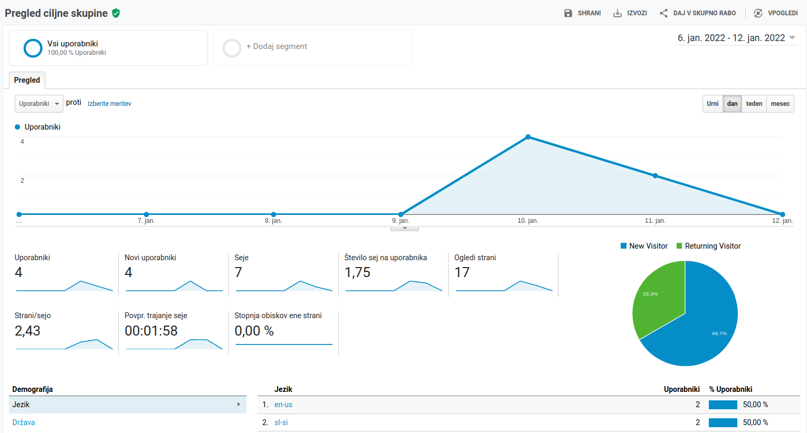
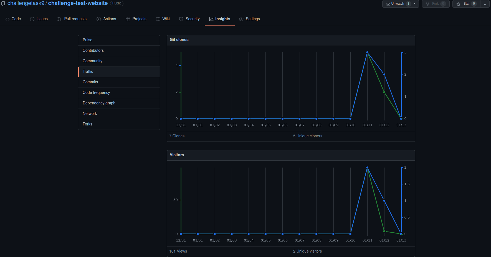
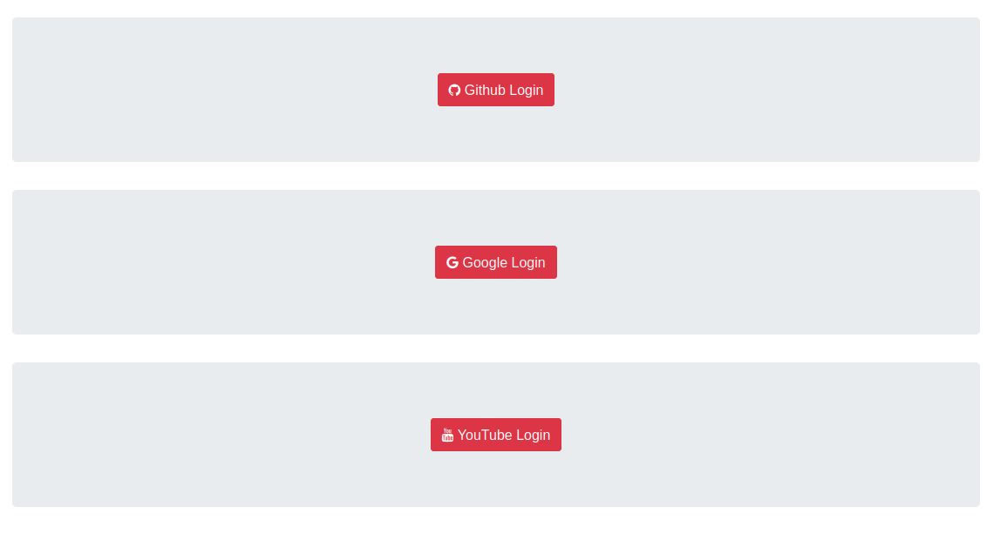
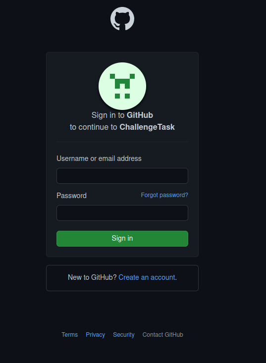
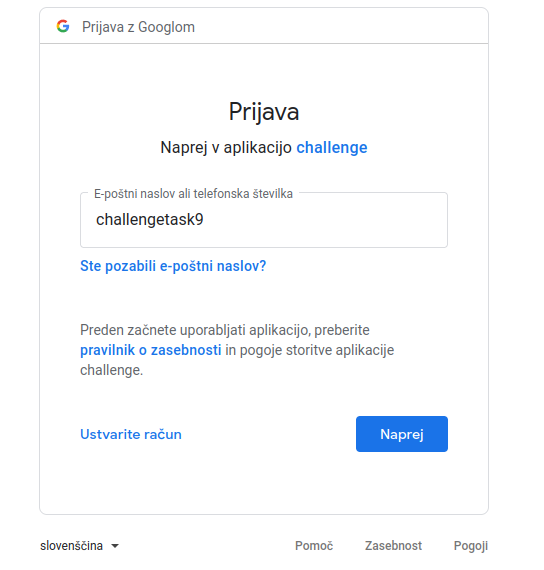
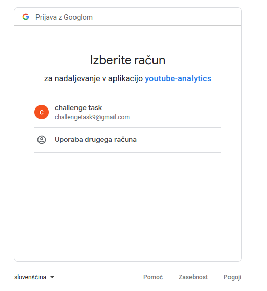
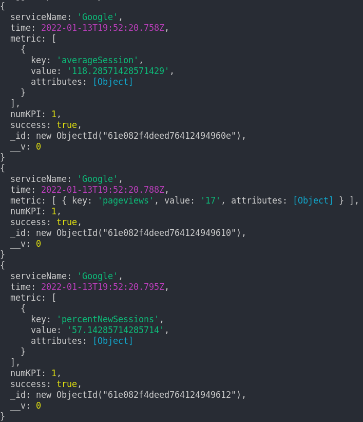
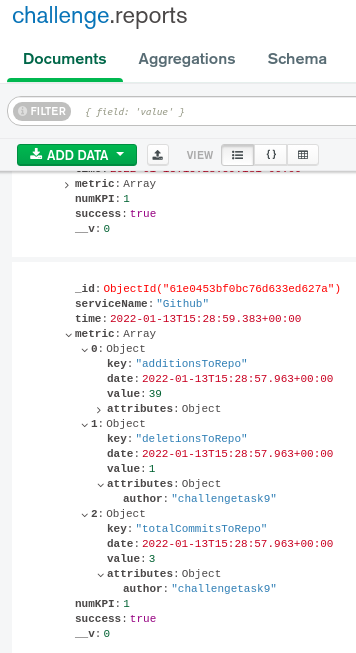
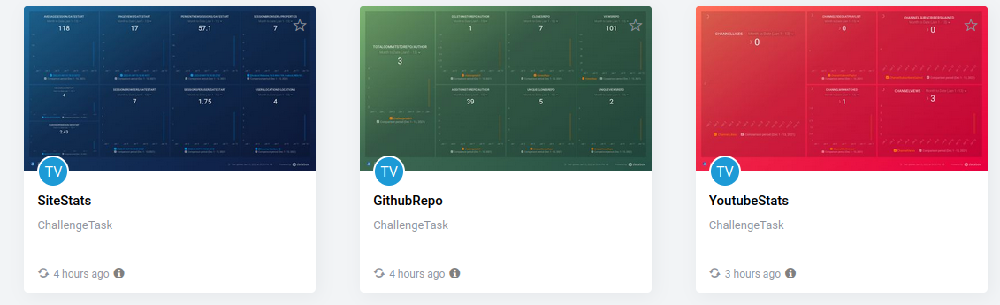

# Challenge task

## APIs included

 - Github API (with OAUTH2)
 - Google Analytics API (with OAUTH2)
 - Youtube Analytics API (with OAUTH2)

## Tasks

 - Getting metrics from above listed APIs
 - Each API requires authorization (OAUTH2)
 - Trigger which sends data when you login to service 
 - Pushing all metrics to Dashboard via PushAPI
 - Saving all activity with MongoDB

**Info:** 
Google Analytics is connected to simple website i launched on another server and extracts only metrics from it's analysis. I created google email for this task. You can find credentials in file "credentials.txt". 

Other two APIs work with any account. 

On Github i created new repository and with content of simple website. All metrics from Github are taken from that repository.

Youtube Analysis extracts your personal Youtube channel metrics. 

I took screenshots and added them to last section "Demonstration"

## Deployment

Clone repository and move into directory:

`git clone https://github.com/challengetask9/challenge.git && cd challenge`

Run application:
  `npm start`

## Demonstration

